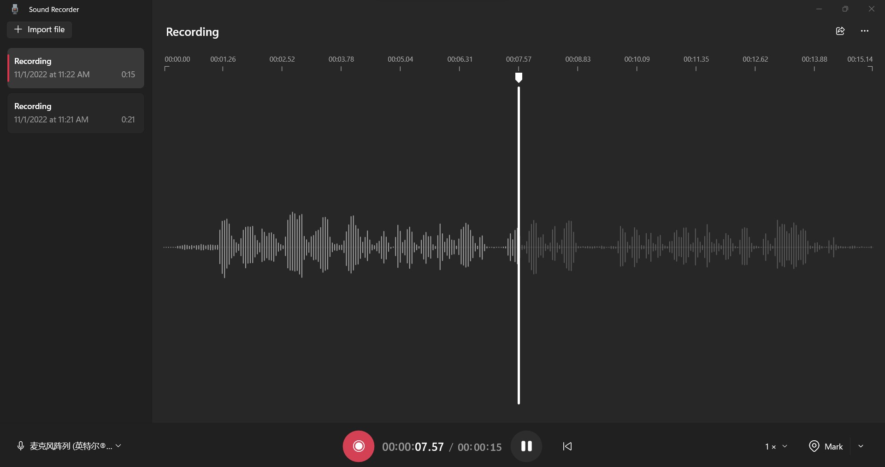

# sribd_blender
- The purpose of this project is to transform the text to Cue Speech. In other words, is a text to video task
- The demo of the project divided into two parts. The first parts is points location generation, the second part is the points displacement
- There still question to merge hands with face. The future method will be merge a new blender repo to our project

## Google-Mediapipe-Main (cite: MediaPipe: A Framework for Building Perception Pipelines  https://arxiv.org/pdf/1906.08172.pdf)
- This folder store the essential code to transform a video body movement to corresponding key points location
- The question of the google-mediapipe is that the output will be divided into three part, body, face, and hands
- The output format of those three are not the same

## Points_import_file
- This folder is transform the points generate by google-mediapipe to a blender animation
- The question of the points_import is that it cannot merge three outputs of mediapipe correctly, sometime need to adjust by hands

## BlenderArMocap (cite: https://github.com/cgtinker/BlendArMocap)
- This folder is a plug in develop by another group, the components of this porject will solve our problem
- However, BlenderArMocap is too large for one to completely understand

# demo displacement

Detection             |  Output 3D location
:-------------------------:|:-------------------------:
  |   

Import to Blender | Render Motion with Predefined Model
:-------------------------:|:-------------------------:
  |

# Render it with blender

### Thanks to blenderArMocap and pipeMedia

## csc3185
- After do some improvement to the SRIBD project, use it as a project in CSC3185
- This is a folder used for producing formated csv file
- Since the txt file generate by media pipe is hard to read
# Transform the video to csv.

## Whisper (cite this paper: Robust Speech Recognition via Large-Scale Weak Supervision https://cdn.openai.com/papers/whisper.pdf)
- transcrip people's voice to text

  
 

 

  
 

## Future work:
- improving the connection of hands and faces by reading the file of blenderArMocap
- adding the generation model to the google-mediapipe
